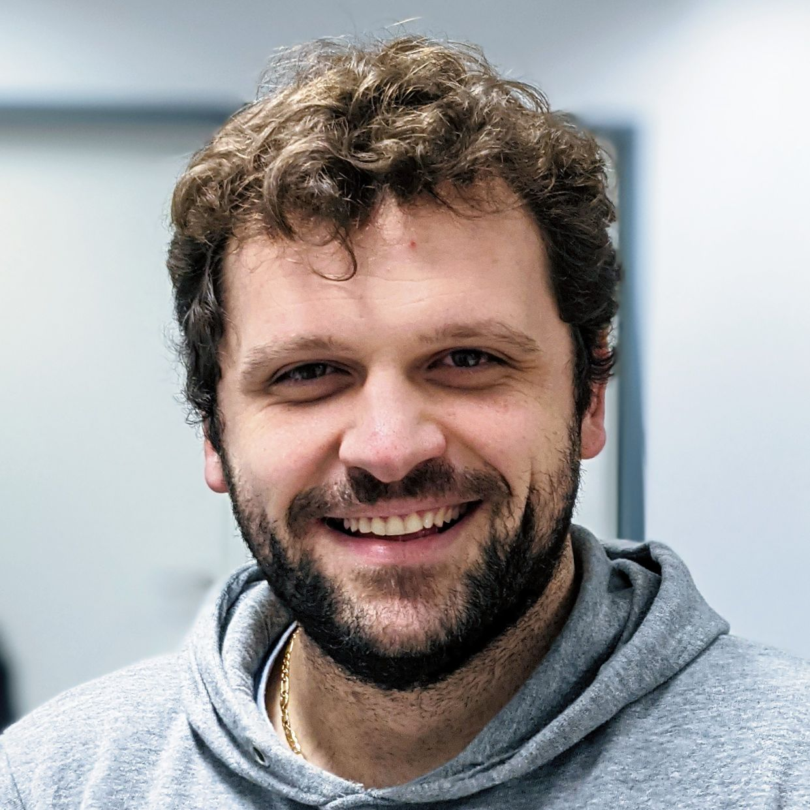

The main objective of this tutorial is to present the theory and applications of affine correspondences (AC) in computer vision. The tutorial will show recent advancements in exploiting affine features in single- and two-view problems, including image rectification, homography and epipolar geometry estimation. Also, we will discuss traditional and recent deep learning-based algorithms for detecting, matching, and robustly using such features in real-world images. 

---
### Info

<ul>
<li><b>Time</b>: Sunday, 06/19/2022, exact time TBD.</li>
<li><b>Location</b>: CVPR 2022, New Orleans, Louisiana, USA, and online, link TBD.</li>
<li><b>Discussion and Q&A</b>: TBD</li>
<li><b>Primary contact</b>: dbarath@ethz.ch </li>
</ul>

--- 
### Organizer

  

    	

	
	

	<a href="https://timomilbich.github.io/">Timo Milbich</a>   LMU Munich, Heidelberg University   timo.milbich@iwr.uni-heidelberg.de
	

	

	&nbsp;

       	

	
	

	<a href="https://dvl.in.tum.de/team/elezi/">Ismail Elezi</a>   Technical University of Munich   ismail.elezi@tum.de
	

	

	&nbsp;

       	

	
	

	<a href="https://ommer-lab.com/people/ommer/">Björn Ommer</a>   LMU Munich, Heidelberg University   ommer@lmu.de
	

	

  

  

       	

	
	

	<a href="https://dvl.in.tum.de/team/seidenschwarz/">Jenny Seidenschwarz</a>   Technical University of Munich   j.seidenschwarz@tum.de
	

	

	&nbsp;

       	

	
	

	<a href="https://dvl.in.tum.de/team/lealtaixe/">Laura Leal-Taixe</a>   Technical University of Munich   leal.taixe@tum.de
	

	

  

---
### Announcements

<b>Feb 15, 2022</b> &emsp; Our tutorial has been accepted to CVPR 2022!  
<b>Apr 04, 2022</b> &emsp; More information to come soon, stay tuned.

