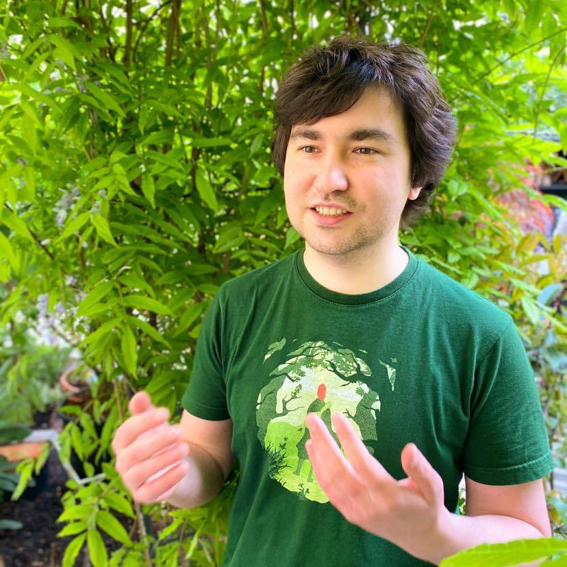

The main objective of this tutorial is to present the theory and applications of affine correspondences (AC) in computer vision. The tutorial will show recent advancements in exploiting affine features in single- and two-view problems, including image rectification, homography and epipolar geometry estimation. Also, we will discuss traditional and recent deep learning-based algorithms for detecting, matching, and robustly using such features in real-world images. 

---
### Info

<ul>
<li><b>Time</b>: Sunday, 06/19/2022, exact time TBD.</li>
<li><b>Location</b>: CVPR 2022, New Orleans, Louisiana, USA, and online, link TBD.</li>
<li><b>Discussion and Q&A</b>: TBD</li>
<li><b>Primary contact</b>: dbarath@ethz.ch </li>
</ul>

--- 
### Organizer

  

    	

	
	

	<a href="http://people.inf.ethz.ch/dbarath/">Daniel Barath</a>   Computer Vision and Geometry Group, ETH Zurich   dbarath@ethz.ch
	

	

	&nbsp;

       	

	
	

	<a href="https://dmytro.ai/">Dmytro Mishkin</a>   Center for Machine Perception, Department of Cybernetics, Faculty of Electrical Engineering, Czech Technical University, Prague   ducha.aiki@gmail.com
	

	

	&nbsp;

       	

	
	

	<a href="https://prittjam.github.io/">James Pritts</a>   Applied Algebra & Geometry Group, Czech Institute of Informatics, Robotics and Cybernetics, Czech Technical University in Prague  jbpritts@gmail.com
	

	

  

  

       	

	
	

	<a href="http://cv.inf.elte.hu/">Levente Hajder</a>   Geometric Computer Vision Group, Department of Algorithms and their Applications, Eötvös Loránd University  hajder@inf.elte.hu
	

	

  

---
### Announcements

<b>Feb 15, 2022</b> &emsp; Our tutorial has been accepted to CVPR 2022!  
<b>Apr 04, 2022</b> &emsp; More information to come soon, stay tuned.

